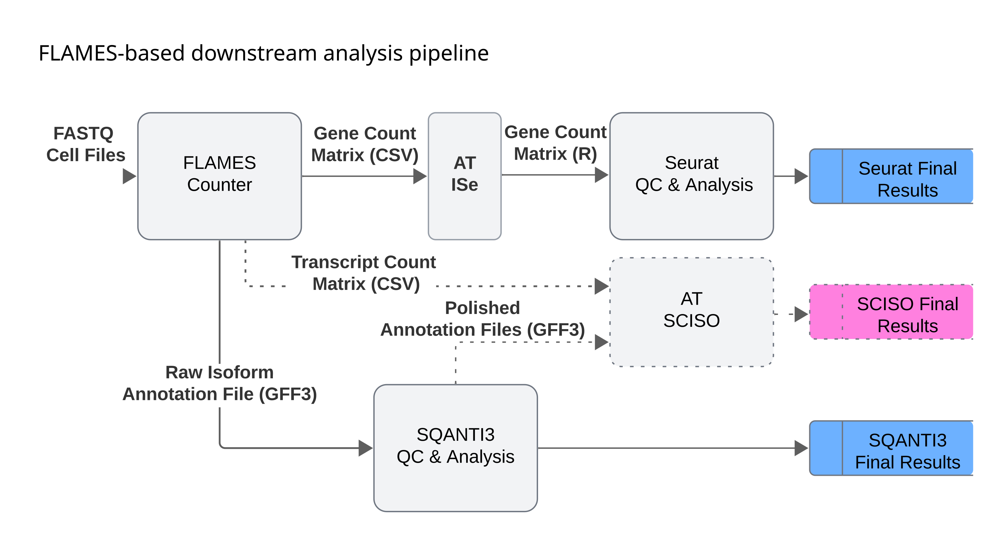

# ArgenTag Pipeline README

**Version: AT_25.03.01**

**IMPORTANT NOTE**: This software package only includes the **AT CellExtractor** and **AT FlamesCounter** modules of the full ArgenTag pipeline. Other modules referenced in the documentation are separate tools.

## Table of Contents

1. [Introduction](#introduction)
2. [Pipeline Components](#pipeline-components)
3. [Execution Guide](#execution-guide)
   - [System Requirements](#system-requirements)
   - [Installation](#installation)
   - [Running the Pipeline](#running-the-pipeline)
   - [Pipeline Steps](#pipeline-steps)
   - [Directory Structure](#directory-structure)
   - [Interactive Step](#interactive-step)
   - [Skipping Pipeline Steps](#skipping-pipeline-steps)
   - [Logs and Monitoring](#logs-and-monitoring)
4. [Troubleshooting](#troubleshooting)

## Introduction

ArgenTag (AT) is a computational pipeline designed for processing and analyzing single-cell long-read RNA sequencing data. The pipeline takes demultiplexed FASTQ reads as input and produces gene/transcript count matrices and isoform annotation files for downstream analysis.


**Fig. 1.** ArgenTag (AT) pipeline, current version AT_25.03.01. Dashed lines indicate functionalities under development.

## Pipeline Components

ArgenTag consists of the following main modules:

### AT CellExtractor (Included)

**Input:** Demultiplexed FASTQ Reads  
**Output:** FASTQ Cell Files

**Description:**
- Performs rapid cell calling on Taggy demultiplexed FASTQ reads
- Generates an elbow graph and determines the knee and other significant points for cell calling
- Produces a read length histogram with statistics
- Creates FASTQ cell files ready for downstream screening of cells and QC filtering

### AT FlamesCounter (Included)

**Input:** FASTQ Cell Files  
**Output:** Gene Count Matrix (CSV), Transcript Count Matrix (CSV), Isoform Annotation Files (GTF)

**Description:**
- Performs gene and transcript quantification at the cell level
- Generates gene and transcript count matrices from minimap2 alignment of FASTQ cell files to a genome reference and its GTF annotation file
- Produces gene and isoform GTF annotation files

This module reuses parts of the Bioconductor FLAMES code (version 2.1.7) [https://github.com/mritchielab/FLAMES/](https://github.com/mritchielab/FLAMES/) for transcript quantification and isoform annotation.

### AT ISe (Not Included)

**Input:** Gene Count Matrix (CSV)  
**Output:** Gene Count Matrix (R)

**Description:**
- Acts as an interface between FlamesCounter outputs and Seurat inputs
- Generate a genes x BCs matrix (R object) suitable for Seurat input
- Converts original gene IDs to gene names to ensure Seurat compatibility

### Seurat v5.2.1 (Third-party Tool) (Not Included)

**Input:** Gene Count Matrix (R matrix)  
**Output:** Seurat Final Results

**Description:**
- Implements major components for QC, analysis, and exploration of single-cell RNA-seq data at the gene level
- Performs quality control on the gene count matrix, removing low-quality cells and genes
- Applies the scTransform to gene counts and identifies 2000 highly variable genes
- Determines the dimensionality of the filtered gene count matrix using PCA
- Generates UMAP clusters of cells and produces gene marker files for these clusters

### SQANTI3 5.2.2 (Third-party Tool) (Not Included)

**Input:** Raw Isoform GTF annotation file  
**Output:** Polished Isoform Annotation file (GTF), SQANTI3 Final Results

**Description:**
- Implements quality control, filtering, and characterization of long read-defined transcriptomes at the bulk level
- Generates a raw isoform report with classification categories and QC metrics
- Produces a curated isoform report by applying automatic isoform filtering and rescue rules
- Rules for isoform curation are sequencing platform-specific; ONT rules are more stringent than PacBio ones

For detailed methodologies, please refer to the respective documentation for Seurat ([https://satijalab.org/seurat/articles/get_started_v5_new](https://satijalab.org/seurat/articles/get_started_v5_new)) and SQANTI3 ([https://github.com/ConesaLab/SQANTI3/wiki/Introduction-to-SQANTI3](https://github.com/ConesaLab/SQANTI3/wiki/Introduction-to-SQANTI3)).

### AT SCISO (Under Development) (Not Included)

**Input:** Polished GTF Isoform Annotation Files, Transcript Count Matrix (CSV)  
**Output:** Final SCISO Results

**Description:**
- Cleans the given Transcript Count Matrix with Polished Isoform Annotation Files
- Generates an isoform-based UMAP clustering of cells

## Execution Guide

### System Requirements

- Python 3.6 or higher
- R with required packages:
  - remotes
  - Cairo
  - FLAMES
- minimap2 and k8 installed and accessible
- Reference files:
  - Genome FASTA file (.fa)
  - Genome index file (.mmi)
  - Annotation GTF file (.gtf)

### Installation

The ArgenTag pipeline is provided as an executable file. No specific installation is required beyond ensuring that all prerequisites are met.

### Running the Pipeline

#### Usage

```bash
# AT DA Pipeline v1.0.1
## Usage Instructions:
-------------------

1. Open a terminal or command prompt
2. Navigate to the directory where this executable is located
3. Make the binary executable if it isn't already:

   chmod +x at_pipeline_part1

4. Run the command with the required parameters:

./at_pipeline_part1 --output_dir /path/output --experiment_name experiment_name \
--minimap2_path /path/minimap2 --k8_path /path/k8 \
--genome_mmi /path/genome.mmi --genome_fa /path/genome.fa \
--annot_gtf /path/annotation.gtf --config_file /path/config.json \
--demux_dir /path/demultiplexed
```

#### Command Parameters

- `--output_dir` Base output directory
- `--experiment_name` Experiment name
- `--minimap2_path` Path to minimap2 executable
- `--k8_path` Path to k8 executable
- `--genome_mmi` Path to genome.mmi file
- `--genome_fa` Path to genome.fa file
- `--annot_gtf` Path to GTF annotation file
- `--config_file` Path to FLAMES configuration file
- `--demux_dir` Directory with demultiplexed data
- `--threads` Number of threads for parallel processes (default: 60)
- `--skip_steps` List of steps to skip (comma-separated)
- `--version` Shows program version and exits

#### Configuration Files

**Reference Files**

All reference files should be downloaded from [https://www.ensembl.org/](https://www.ensembl.org/):
- Genome FASTA file (specified in --genome_fa)
- Annotation GTF file (specified in --annot_gtf)

**Creating the MMI Index File**

Before running the pipeline, you need to create a minimap2 index file (.mmi) from your reference genome. Use the following command:

```bash
minimap2 -x splice -k14 --seed 2022 -t [threads] -d genome.mmi genome.fa
```

**FLAMES Configuration**

The pipeline requires a FLAMES configuration file in JSON format. You can download the default configuration file from the FLAMES GitHub repository:

https://github.com/mritchielab/FLAMES/blob/devel/inst/extdata/config_sclr_nanopore_3end.json

Download this file and specify its path in the `--config_file` parameter when running the pipeline.

**IMPORTANT:** When using the FLAMES configuration file, ensure that the `"do_barcode_demultiplex"` parameter is set to `false`:

```json
"pipeline_parameters": {
    ...
    "do_barcode_demultiplex": false,
    ...
}
```

#### Using Screen Sessions

It's recommended to run the pipeline within a screen session to prevent interruptions in case your connection drops. Screen allows you to run processes in the background and reconnect to them later.

```bash
# Start a new screen session
screen -S argentag_run

# Run the pipeline within the screen session
./at_pipeline_part1 [arguments]

# Detach from the screen session (without stopping the process)
# Press Ctrl+A, then D

# To reconnect to your screen session later
screen -r argentag_run

# To list all available screen sessions
screen -ls
```

Using screen is especially helpful for the ArgenTag pipeline since some steps can take hours to complete, particularly when processing large datasets.

#### Example of execution:

```bash
OUTPUT_DIR="/.../processing_example"
EXPERIMENT_NAME="Belgium_test"
MINIMAP2_PATH="/.../minimap2/minimap2"
K8_PATH="/.../minimap2/k8"
GENOME_MMI="/.../Homo_sapiens.GRCh38.dna.toplevel_k14.mmi"
GENOME_FA="/.../Homo_sapiens.GRCh38.dna.toplevel.fa"
ANNOT_GTF="/.../Homo_sapiens.GRCh38.112.gtf"
CONFIG_FILE="/.../config_sclr_ont_ss.json"
DEMUX_DIR="/.../raw_data_example"
THREADS=60

./at_pipeline_part1 --output_dir "$OUTPUT_DIR" \
--experiment_name "$EXPERIMENT_NAME" \
--demux_dir "$DEMUX_DIR" \
--minimap2_path "$MINIMAP2_PATH" \
--k8_path "$K8_PATH" \
--genome_mmi "$GENOME_MMI" \
--genome_fa "$GENOME_FA" \
--annot_gtf "$ANNOT_GTF" \
--config_file "$CONFIG_FILE" \
--threads "$THREADS"
```

### Pipeline Steps

The pipeline execution is organized into the following steps:

1. **Directory Structure Creation**  
   Creates all necessary directories for analysis outputs.

#### AT CellExtractor

2. **Barcode Counting**  
   Processes the demultiplexed data to count barcode frequencies.

3. **Elbow Analysis** (Interactive)  
   Performs statistical analysis to determine cell/background threshold. This step **requires user interaction** to select a cut-off threshold on an elbow plot.

4. **Goldenlist Splitting**  
   Divides the filtered barcode list (goldenlist) for parallel processing.

5. **Goldenlist Filtering**  
   Filters the demultiplexed data using the goldenlist of valid cell barcodes.

6. **FASTQ Concatenation**  
   Combines filtered FASTQ files into a single file for downstream analysis.

#### AT FlamesCounter

7. **FLAMES Pipeline Execution**  
   Runs the FLAMES analysis pipeline for gene and isoform detection and quantification.

Note: All steps after this point would require additional tools not included in this package.

### Directory Structure

The pipeline will automatically generate the following directory structure:

```
[output_dir]/
└── AT_Downstream_Analysis/
    └── [experiment_name]/
        ├── Analysis/
        │   └── Flames/           # For FLAMES pipeline results
        ├── Counts/               # For barcode counting and cell calling
        │   └── CellCalling/
        │       └── GL/           # For barcode goldenlist
        ├── Demuxed/              # For demultiplexed files
        ├── Demuxed_Filtered/     # For filtered data
        ├── Demuxed_Filtered_All/ # For concatenated and filtered data
        └── Logs/                 # For log files
```

### Interactive Step

Step 3 (Elbow Analysis) requires user interaction. The script will display information about potential cutoff thresholds and show the path to a generated graph that helps with decision support. You will be prompted to review this visualization and select an appropriate threshold for cell calling based on the barcode count distribution.

**Example:**

```
===== Cutoff Selection Menu =====

Select a cutoff point:
1. 99th percentile (Reads: 64, PutativeCells: 1536)
2. 98th percentile (Reads: 51, PutativeCells: 2998)
3. 97th percentile (Reads: 43, PutativeCells: 4550)
4. 96th percentile (Reads: 37, PutativeCells: 6009)
5. 95th percentile (Reads: 31, PutativeCells: 7612)
6. Knee point (Reads: 31, PutativeCells: 7612)
7. Inflection point (Reads: 15, PutativeCells: 9981)
8. Other (custom value)

Please enter your selection (1-8) and press Enter: 7
```

### Skipping Pipeline Steps

A key feature of our pipeline architecture is the ability to skip steps that have already been successfully executed or resume execution from an intermediate point. This is particularly useful when a process is interrupted and you need to restart without repeating already completed work. For example:

```bash
./at_pipeline_part1 --output_dir /path/output --experiment_name experiment_name \
--minimap2_path /path/minimap2 --k8_path /path/k8 \
--genome_mmi /path/genome.mmi --genome_fa /path/genome.fa \
--annot_gtf /path/annotation.gtf --config_file /path/config.json \
--demux_dir /path/demultiplexed --skip_steps 1,2
```

This would skip the directory creation (step 1) and barcode counting (step 2).

### Logs and Monitoring

The pipeline generates comprehensive logs in the `[experiment_name]/Logs/` directory. Each pipeline run creates a timestamped log file with detailed information about each step's execution.

## Troubleshooting

If you encounter errors during execution:

- Review the log files in the `logs/` directory
- Verify that all provided paths are absolute and correct
